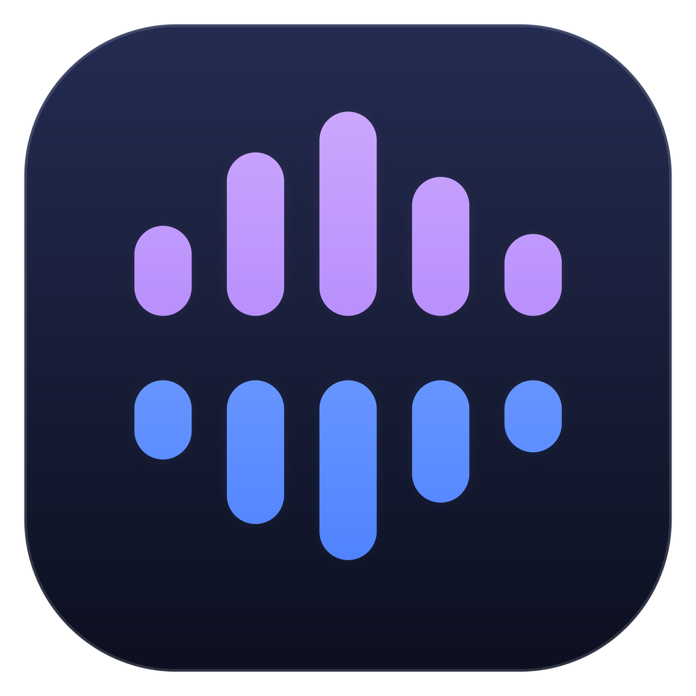

<a id="readme-top"></a>

<p align="center">
  
</p>

# Demucs Studio

**Tách giọng hát khỏi nhạc nền, ngay trên máy bạn**

Dán link YouTube → tải nhạc về → tách riêng vocal và beat bằng Demucs v4 hoặc BS‑RoFormer.  

Không cần tài khoản, không upload file đi đâu, và sau lần tải model đầu tiên thì chạy hoàn toàn offline.


**[Cài đặt](#cai-dat)** · **[Bắt đầu](#ba-buoc)** · [Chọn model](#chon-model) · [Tài liệu đầy đủ](https://sonnam0904.github.io/demucs-studio/) · [Báo lỗi](https://github.com/sonnam0904/demucs-studio/issues)


---


## 🎧 Nó làm gì

```
1 · Nguồn audio    [ https://youtube.com/watch?v=… ]   [Xem thông tin] [Tải WAV]
                   …hoặc chọn một file audio có sẵn trên máy

2 · File nguồn     ảnh bìa + tiêu đề + player nghe thử

3 · Tách vocal     Model ▾   Thiết bị ▾   Stem ▾            [Tách vocal]

4 · Kết quả        vocals.wav · no_vocals.wav
                   player riêng cho từng stem + nút mở thư mục
```

Thanh dưới cùng chạy tiến độ thật — tải theo byte, tách theo từng sub‑model — kèm
ô nhật ký xem được nguyên văn output của yt-dlp và engine. Bấm **Huỷ** là dừng
thật, kể cả các process con.


|                                   |                                                                                                |
| --------------------------------- | ---------------------------------------------------------------------------------------------- |
| 🎚️ **Hai engine**                | Demucs v4 và họ RoFormer, chọn trong cùng một dropdown                                         |
| 💾 **Model tải một lần**          | Lưu trong thư mục của app, có progress bar thật, sau đó chạy offline                           |
| 🔧 **Tự lo phụ thuộc**            | Thiếu `yt-dlp` hay `ffmpeg` thì bấm một nút là app tải bản chính thức về và đối chiếu checksum |
| 🐍 **Không đụng Python hệ thống** | Engine được cài vào môi trường Python riêng của app                                            |
| 🎮 **Kiểm tra GPU thật**          | App chạy thử một CUDA kernel trước khi quyết định dùng GPU                                     |


---


<a id="cai-dat"></a>

## ⬇️ Cài đặt

Tải file ở trang **[Releases](https://github.com/sonnam0904/demucs-studio/releases)**.


| Hệ điều hành                     | Cách cài                                                    |
| -------------------------------- | ----------------------------------------------------------- |
| Ubuntu / Debian / Pop!_OS / Mint | `sudo apt install ./demucs-studio_*_amd64.deb`              |
| Fedora / openSUSE                | `sudo dnf install ./demucs-studio-*.x86_64.rpm`             |
| Linux khác, hoặc chạy từ USB     | Giải nén `*-linux-amd64.tar.gz` rồi chạy `./run.sh`         |
| Windows 10 / 11                  | Giải nén `*-windows-amd64.zip` rồi chạy `demucs-studio.exe` |
| macOS (Intel & Apple Silicon)    | Mở `*-macos-universal.dmg`, kéo app vào **Applications**     |


> [!IMPORTANT]
> Muốn **tách nhạc** thì máy cần **Python 3.10 trở lên** cài sẵn — phần còn lại app
> tự lo. Chỉ muốn **tải audio** về thì không cần Python.
>
> Trên Windows hãy cài Python từ [python.org](https://www.python.org/downloads/windows/),
> **đừng dùng bản Microsoft Store** — app từ chối bản đó vì chạy nó chỉ mở Store
> chứ không phải interpreter.

> [!NOTE]
> Windows hiện *"Windows protected your PC"* → **More info** → **Run anyway**. Ứng
> dụng chưa mua chứng chỉ ký số nên Windows cảnh báo mặc định. Nếu báo thiếu
> **WebView2**: cài [WebView2 Runtime](https://developer.microsoft.com/microsoft-edge/webview2/)
> rồi mở lại — Windows 11 đã có sẵn.
>
> macOS báo *"is damaged and can't be opened"* — app không hỏng, đó là cờ
> quarantine của Gatekeeper vì cùng lý do chưa ký số. Gỡ một lần bằng:
> `xattr -dr com.apple.quarantine /Applications/DemucsStudio.app`

**Build từ source**

Cần Go, Node.js, và trên Linux thêm `libgtk-3-dev` + `libwebkit2gtk-4.1-dev`.

```bash
git clone https://github.com/sonnam0904/demucs-studio
cd demucs-studio
make doctor      # kiểm tra phụ thuộc build
make linux       # hoặc: make windows / make darwin
```

Bản macOS phải build ngay trên máy Mac (`make package-darwin`) — backend WKWebView
cần CGO nên không cross-compile được từ Linux.

→ Chi tiết: [docs/build.md](docs/build.md)


→ Hướng dẫn cài từng bước, kèm bảng phụ thuộc và cách gỡ:
**[Cài đặt](https://sonnam0904.github.io/demucs-studio/installation/)**

---


<a id="ba-buoc"></a>

## 🚀 Ba bước để tách được nhạc


### Bước 1 — Cài `yt-dlp` và `ffmpeg`

Tab **Phụ thuộc** → dòng nào thiếu sẽ có nút **Cài tự động**. App tải bản chính
thức từ GitHub và đối chiếu checksum do chính dự án đó công bố.

> [!TIP]
> Dòng **JS runtime** báo thiếu thì nên cài `deno`, `node` hoặc `bun`. YouTube bắt
> giải một thử thách JavaScript để lấy link nhạc; không có runtime thì một số video
> sẽ lỗi. `deno` nhẹ nhất.


### Bước 2 — Cài engine tách nhạc

Vẫn ở tab **Phụ thuộc**, khối *Cài engine Python*: chọn **PyTorch** (*Dùng lại bản
đã có* nếu máy đã có, *CUDA* nếu có GPU NVIDIA, còn lại chọn *CPU*), tick engine
muốn dùng, rồi bấm **Cài engine**.

> [!WARNING]
> Bản CUDA nặng khoảng 2,5 GB nên lần đầu khá lâu. Theo dõi ở ô *Nhật ký* dưới cùng.


### Bước 3 — Tách thử một bài

1. Tab **Tách nhạc** → dán link → **Tải WAV**.
2. Để **Model** ở `htdemucs_ft` → bấm **Tách vocal**.
3. Xong: mỗi stem có player riêng để nghe thử, kèm nút mở thư mục.

Kết quả nằm ở `~/Music/DemucsStudio/stems/<tên bài>/<model>/`.

→ Giải thích từng ô chọn và cách tinh chỉnh:
**[Hướng dẫn sử dụng](https://sonnam0904.github.io/demucs-studio/usage/)**

---


<a id="chon-model"></a>

## 🎚️ Chọn model nào?


| Engine                | Model                                       | Dùng khi                                         |
| --------------------- | ------------------------------------------- | ------------------------------------------------ |
| **Demucs v4**         | `htdemucs_ft` *(mặc định)*                  | Lựa chọn an toàn nhất — bag of 4 model, ≈ 328 MB |
|                       | `htdemucs`                                  | Cần nhanh, nhanh hơn ~4×                         |
|                       | `htdemucs_6s`                               | Muốn tách thêm **guitar** và **piano**           |
| **BS-RoFormer**       | Vocals Resurrection, Vocals Revive V3e, SW… | Muốn vocal tốt nhất **và có GPU**                |
| **Mel-Band RoFormer** | Kim FT2, Big Beta 6X…                       | Cân bằng — gần bằng BS-RoFormer nhưng nhanh hơn  |
|                       | Karaoke (aufr33/viperx, anvuew)             | Tách vocal chính khỏi hát đệm                    |


10 model RoFormer có sẵn. Muốn thêm: tab **Model** → **Tìm thêm model RoFormer**
(đọc trực tiếp từ `audio-separator`, hiện khoảng 89 model).

> [!IMPORTANT]
> **RoFormer nặng hơn Demucs đáng kể.** Đo trên clip 19 giây, CPU Intel i5‑11400:
> `htdemucs_ft` mất **35 giây**, Mel‑Band Kim FT2 mất **172 giây**. Có GPU thì
> RoFormer nhanh hơn nhiều lần — **chỉ có CPU thì cứ dùng** `htdemucs_ft`**.**

---


## 🩺 Gặp lỗi?

Lỗi phổ biến nhất là tải nhạc báo `HTTP Error 403: Forbidden`, và gần như luôn
cùng một nguyên nhân: **yt-dlp đã cũ**. YouTube ra cơ chế chống bot mới vài tuần
một lần.

**Cách sửa:** tab **Phụ thuộc** → **Cập nhật yt-dlp**.

→ Video bị chặn, GPU hết VRAM, badge ghi *CPU only* dù có card NVIDIA, tách quá
chậm: **[Xử lý sự cố](https://sonnam0904.github.io/demucs-studio/troubleshooting/)**

---


## 📚 Tài liệu

Đầy đủ ở **[sonnam0904.github.io/demucs-studio](https://sonnam0904.github.io/demucs-studio/)**


|                                         |                                                                       |
| --------------------------------------- | --------------------------------------------------------------------- |
| [Cài đặt](docs/installation.md)         | Cài app, công cụ tải nhạc, engine Python, thư mục dữ liệu, gỡ cài đặt |
| [Hướng dẫn sử dụng](docs/usage.md)      | Quy trình bốn bước, chọn model, tinh chỉnh, cookies                   |
| [Xử lý sự cố](docs/troubleshooting.md)  | Các lỗi thường gặp và cách sửa                                        |
| [Build từ source](docs/build.md)        | Các lệnh `make` và yêu cầu build của từng nền tảng                    |
| [Ghi chú kỹ thuật](docs/engineering.md) | Cấu trúc code và những chỗ dễ sai                                     |


## 🛠️ Dành cho người phát triển

Viết bằng Go + [Wails v2](https://wails.io), frontend TypeScript không framework.

```bash
make dev      # live reload
make test     # unit test
make e2e      # test tích hợp thật (có mạng, chạy tách nhạc thật)
```

> [!NOTE]
> Bản Linux đã được kiểm chứng end‑to‑end. **Bản Windows và macOS tới giờ chỉ được
> compile và unit test, chưa chạy thật trên máy Windows hay Mac** — rất hoan nghênh
> báo cáo từ người dùng hai nền tảng đó.


## 📄 Giấy phép

[MIT](LICENSE). Demucs (MIT, Meta) và các model RoFormer giữ giấy phép riêng của
tác giả — kiểm tra trước khi dùng cho mục đích thương mại.

[↑ Về đầu trang](#readme-top)
